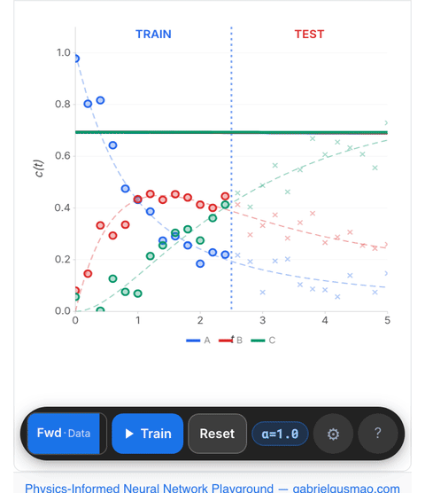

### Gabriel S. Gusmão

Chemical engineer and scientist working on physics-informed neural networks, neural ODEs, and uncertainty quantification for reaction kinetics and dynamical systems.

Ph.D. from [Georgia Tech](https://www.chbe.gatech.edu/) ([Medford Group](https://www.medford.chbe.gatech.edu/))

[PINN Playground](https://www.gabrielgusmao.com/blog/kinns-playground/) · [Scholar](https://scholar.google.com/citations?user=qdPjGE8AAAAJ)
