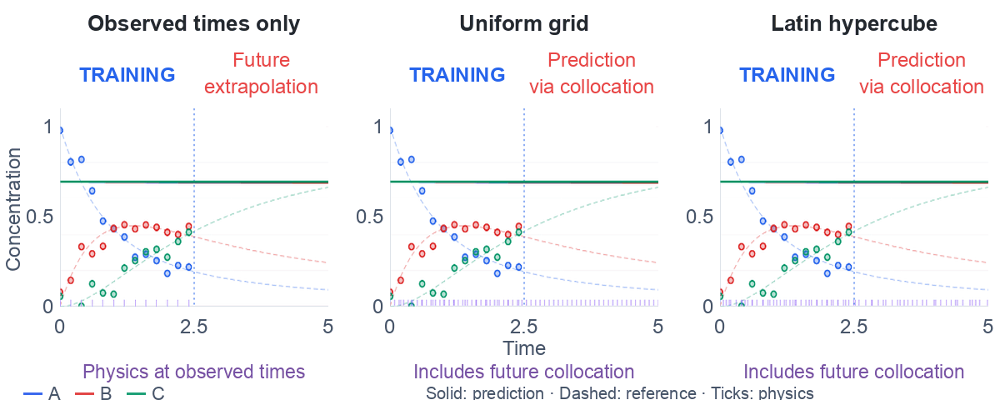
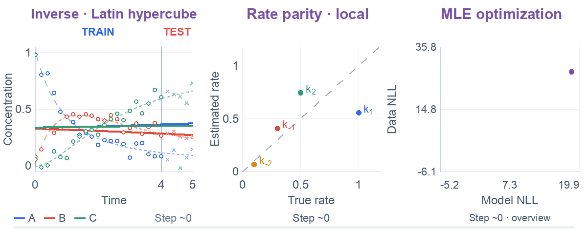

### Gabriel S. Gusmão

Chemical engineer and scientist working on physics-informed neural networks, neural ODEs, and uncertainty quantification for reaction kinetics and dynamical systems.

Ph.D. from [Georgia Tech](https://www.chbe.gatech.edu/) ([Medford Group](https://www.medford.chbe.gatech.edu/))

<strong>Forward PINNs · known rates</strong> 
 
<a href="assets/pinn-forward.gif">Open forward GIF</a>

 

<strong>Inverse PINNs · unknown physical parameters</strong> 
 
<a href="assets/pinn-inverse.gif">Open inverse GIF</a>

Example: kinetics-informed neural networks (KINNs) for A ⇌ B ⇌ C. 
<a href="https://github.com/gusmaogabriels/kinn">KINNs repository</a> · <a href="https://www.gabrielgusmao.com/blog/kinns-playground/">Interactive playground</a> · <a href="https://scholar.google.com/citations?user=qdPjGE8AAAAJ">Publications</a>

